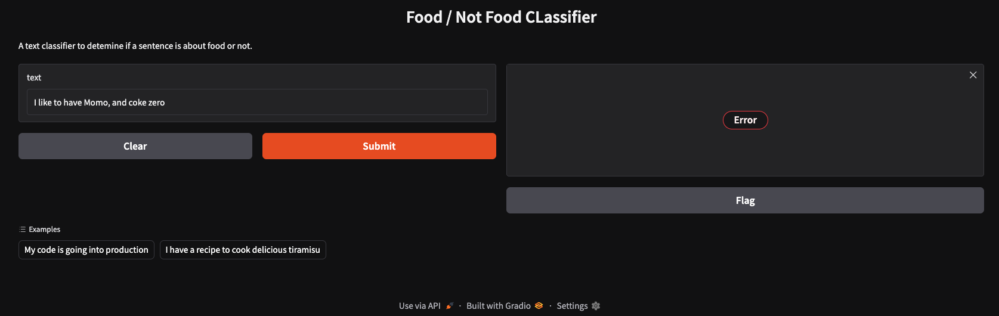

# Food / Not Food Text Classification

A complete NLP text classification project that fine tunes DistilBERT to classify whether a sentence is about **food** or **not food**. This project covers the full workflow from dataset loading and preprocessing to model training, evaluation, Hugging Face Hub deployment, and a Gradio demo for interactive inference.

## Repository

`AnubhavKarki/hf-food-not-food-classification`

## Overview

This project builds a binary text classifier using the Hugging Face ecosystem. The model is trained on a dataset of food and not food image captions and learns to predict whether a given text input belongs to the `food` or `not_food` class.

The pipeline includes:

* loading a dataset from Hugging Face Datasets
* preprocessing and label encoding
* tokenization with DistilBERT tokenizer
* fine tuning a Transformer model for sequence classification
* evaluation on a held out test split
* saving and publishing the trained model to Hugging Face Hub
* building an interactive Gradio app
* preparing the app for deployment on Hugging Face Spaces

## Demo of the project in Gradio



## Problem Statement

Given a text input such as a caption, phrase, or sentence, the goal is to classify it into one of two categories:

* `food`
* `not_food`

Examples:

* `"Salmon and rice is a healthy food combination."` → `food`
* `"Homage to Catalonia is written by George Orwell."` → `not_food`

## Tech Stack

* Python
* PyTorch
* Hugging Face Transformers
* Hugging Face Datasets
* Hugging Face Evaluate
* Hugging Face Hub
* Gradio
* Hugging Face Spaces
* NumPy
* Pandas
* Matplotlib

## Dataset

The project uses the following dataset from Hugging Face:

`mrdbourke/learn_hf_food_not_food_image_captions`

This dataset contains text captions labeled as either food or not food.

### Dataset workflow

* load dataset from Hugging Face
* extract unique labels
* create `id2label` and `label2id` mappings
* convert labels into model ready numeric targets
* split into training and test sets using an 80/20 split

## Model

The base model used for fine tuning is:

`distilbert/distilbert-base-uncased`

### Why DistilBERT

DistilBERT provides a strong balance between performance and efficiency. It is smaller and faster than BERT while still retaining strong language understanding capabilities, making it a practical choice for text classification tasks.

## Project Pipeline

### 1. Data Loading

The dataset is loaded directly from Hugging Face using `datasets.load_dataset()`.

### 2. Label Mapping

String labels are mapped into numeric form for training.

Example mapping structure:

* `food` → `1`
* `not_food` → `0`

The exact mapping is created programmatically from the dataset.

### 3. Train Test Split

The dataset is shuffled and split into:

* 80% training data
* 20% test data

A fixed random seed is used for reproducibility.

### 4. Tokenization

Text inputs are tokenized using `AutoTokenizer` from the DistilBERT checkpoint.

Tokenization includes:

* padding
* truncation
* batching for faster preprocessing

### 5. Model Fine Tuning

The project uses `AutoModelForSequenceClassification` with two output labels.

Training is handled through Hugging Face `Trainer` and `TrainingArguments`.

### 6. Evaluation

Accuracy is used as the core evaluation metric. Predictions are post processed with `argmax` before metric computation.

### 7. Saving and Publishing

After training, the model is:

* saved locally
* pushed to Hugging Face Hub

### 8. Inference Demo

A Gradio interface is built to let users enter custom text and receive predicted class probabilities.

### 9. Deployment

The Gradio app is prepared for deployment on Hugging Face Spaces using:

* `app.py`
* `requirements.txt`
* `README.md`

## Training Configuration

The training setup used in the notebook includes:

* model: `distilbert/distilbert-base-uncased`
* task: binary text classification
* epochs: `10`
* learning rate: `1e-4`
* train batch size: `32`
* eval batch size: `32`
* evaluation strategy: `epoch`
* save strategy: `epoch`
* best model loaded at end: `True`
* save total limit: `3`
* seed: `42`

## Evaluation Metric

The primary evaluation metric is:

* **Accuracy**

The evaluation function converts model logits into predicted class IDs before comparing them against the reference labels.

## Inference

The project supports inference in two ways:

### Hugging Face Pipeline

A text classification pipeline is created using the fine tuned model for easy prediction on custom text.

### Raw PyTorch and Transformers

The tokenizer and model can also be loaded directly for lower level inference using:

* `AutoTokenizer`
* `AutoModelForSequenceClassification`

## Gradio Demo

A Gradio app is included to make the model interactive and easy to test.

### Demo features

* text input
* label probability output
* simple examples
* clean interface for quick experimentation

Example inputs:

* `My code is going into production`
* `I have a recipe to cook delicious tiramisu`

## Hugging Face Integration

This project uses multiple Hugging Face tools end to end:

### Hugging Face Datasets

Used to load and work with the `food / not food` caption dataset.

### Hugging Face Transformers

Used for:

* tokenizer loading
* model loading
* model fine tuning
* training with `Trainer`
* inference with `pipeline`

### Hugging Face Hub

Used to publish the trained model for reuse and sharing.

### Gradio

Used to build a lightweight web interface for predictions.

### Hugging Face Spaces

Used to deploy the Gradio app publicly as an interactive demo.

## Repository Structure

```text
hf-food-not-food-classification/
├── README.md
├── notebook.ipynb
├── app.py
├── requirements.txt
└── models/
```

A typical deployment ready version of the project includes:

* the training notebook
* the application script for Gradio
* dependency file
* saved model artifacts
* project documentation

## Installation

Clone the repository:

```bash
git clone https://github.com/AnubhavKarki/hf-food-not-food-classification.git
cd hf-food-not-food-classification
```

Install dependencies:

```bash
pip install -U transformers datasets evaluate accelerate gradio torch
```

## Usage

### Run training

Open the notebook and run the end to end training pipeline.

### Run the Gradio app locally

```bash
python app.py
```

Then open the local Gradio URL shown in the terminal.

